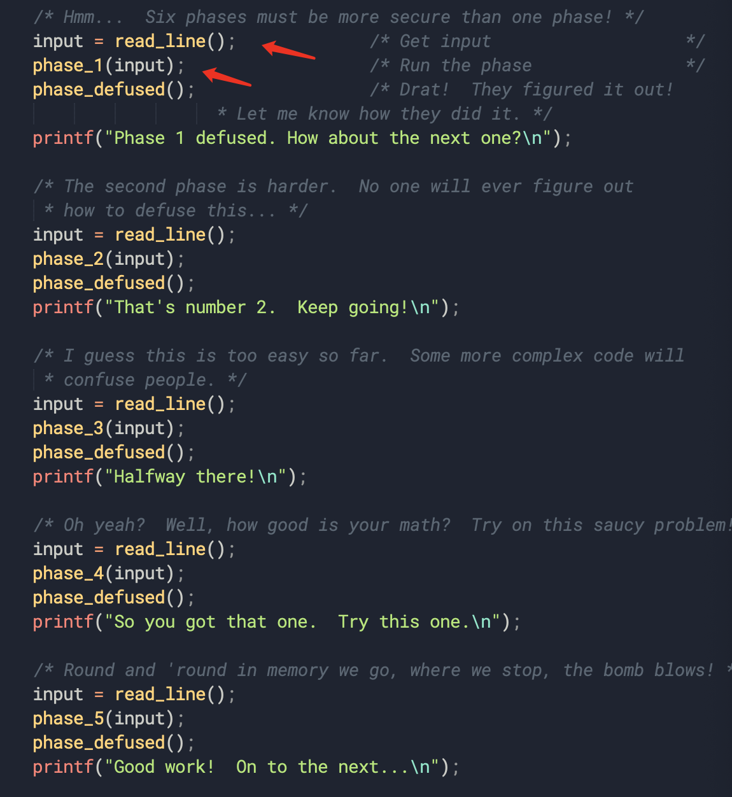
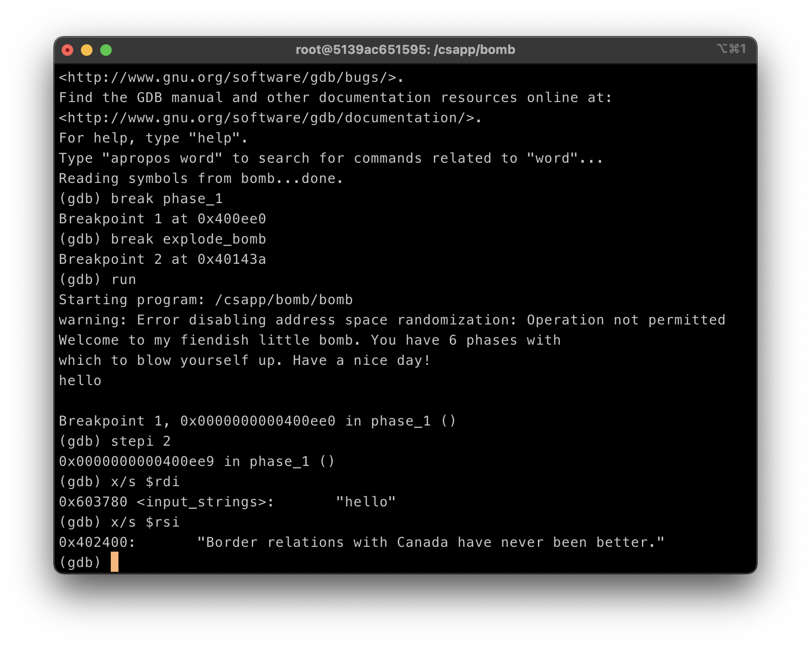

# Bomb Lab

## 介绍

“二进制炸弹”是作为目标代码文件提供给学生的程序。 运行时，它提示用户输入6个不同的字符串。 如果其中任何一个不正确，炸弹就会“爆炸”，学生必须通过拆卸和逆向工程程序来“消散”自己独特的炸弹，以确定6个字符串应该是什么。该实验室教会学生理解汇编语言，并强迫他们学习如何使用调试器。

[实验地址](http://csapp.cs.cmu.edu/3e/labs.html)

[README文档](http://csapp.cs.cmu.edu/3e/README-bomblab)

[实验指导](http://csapp.cs.cmu.edu/3e/bomblab.pdf)

## 实验步骤

使用GDB逆向工程推断6个字符串。设置断点，一步一步调试，找到`explode_bomb`的跳转命令，结合逻辑和寄存器的值进行判断字符串的值。



每一个炸弹都是从`read_line()`函数从输入流stdin中读取的，存放于input变量中，对应`%rax`寄存器中，将`%rax`的值赋给`%rdi`作为参数传递给`phase_x`函数，**`%rdi`中存放的是字符串的首地址**。

[gdb帮助文档](http://csapp.cs.cmu.edu/3e/docs/gdbnotes-x86-64.pdf)

## phase_1

在命令行中使用以下命令：
```bash
调试bomb可执行程序
unix> gdb bomb 

反汇编phase_1函数
gdb> disas phase_1
```
得到：
```bash
gdb) disas phase_1
Dump of assembler code for function phase_1:
   0x0000000000400ee0 <+0>:	sub    $0x8,%rsp
   0x0000000000400ee4 <+4>:	mov    $0x402400,%esi
   0x0000000000400ee9 <+9>:	callq  0x401338 <strings_not_equal>
   0x0000000000400eee <+14>:	test   %eax,%eax
   0x0000000000400ef0 <+16>:	je     0x400ef7 <phase_1+23>
   0x0000000000400ef2 <+18>:	callq  0x40143a <explode_bomb>
   0x0000000000400ef7 <+23>:	add    $0x8,%rsp
   0x0000000000400efb <+27>:	retq
End of assembler dump.
```

1. 字符串首地址在`%rdi`寄存器中。
2. 申请8个字节的栈空间。
3. 将立即数`0x402400`存放到`%esi`寄存器中（第二个参数寄存器）。
4. 调用字符串比较函数，比较是否相同，结果返回于`%eax`中。
5. 检查`%eax`中的值是否为0，为0跳转到<phase_1+23>，跳过引爆炸弹的函数。
6. 否则执行explod_bomb函数，回收栈空间。

故`%esi`寄存器存放的指向字符串的地址便是第一个字符串。

在phase_1和explode_bomb处设置断点并运行，检查`%rsi`寄存器指向字符串的值。



第一个字符串便是`Border relations with Canada have never been better.`。

第一个💣解除。

## phase_2

同样的步骤查看`phase_2`函数的反汇编代码：
```bash
(gdb) disas phase_2
Dump of assembler code for function phase_2:
   0x0000000000400efc <+0>:	push   %rbp
   0x0000000000400efd <+1>:	push   %rbx
   0x0000000000400efe <+2>:	sub    $0x28,%rsp
   0x0000000000400f02 <+6>:	mov    %rsp,%rsi
   0x0000000000400f05 <+9>:	callq  0x40145c <read_six_numbers>
   0x0000000000400f0a <+14>:	cmpl   $0x1,(%rsp)
   0x0000000000400f0e <+18>:	je     0x400f30 <phase_2+52>
   0x0000000000400f10 <+20>:	callq  0x40143a <explode_bomb>
   0x0000000000400f15 <+25>:	jmp    0x400f30 <phase_2+52>
   0x0000000000400f17 <+27>:	mov    -0x4(%rbx),%eax
   0x0000000000400f1a <+30>:	add    %eax,%eax
   0x0000000000400f1c <+32>:	cmp    %eax,(%rbx)
   0x0000000000400f1e <+34>:	je     0x400f25 <phase_2+41>
   0x0000000000400f20 <+36>:	callq  0x40143a <explode_bomb>
   0x0000000000400f25 <+41>:	add    $0x4,%rbx
   0x0000000000400f29 <+45>:	cmp    %rbp,%rbx
   0x0000000000400f2c <+48>:	jne    0x400f17 <phase_2+27>
   0x0000000000400f2e <+50>:	jmp    0x400f3c <phase_2+64>
   0x0000000000400f30 <+52>:	lea    0x4(%rsp),%rbx
   0x0000000000400f35 <+57>:	lea    0x18(%rsp),%rbp
   0x0000000000400f3a <+62>:	jmp    0x400f17 <phase_2+27>
   0x0000000000400f3c <+64>:	add    $0x28,%rsp
   0x0000000000400f40 <+68>:	pop    %rbx
   0x0000000000400f41 <+69>:	pop    %rbp
   0x0000000000400f42 <+70>:	retq
End of assembler dump.
```
我们可以看到将`%rbp`和`%rbx`压入栈后，请求了0x28大小的栈空间，将`%rsp`赋给`%rsi`第二个寄存器，第一个参数寄存器是`%rdi`，然后进去了`read_six_numbers`函数，根据名字是估计读入6个数字的函数。

我们进入`read_six_numbers`函数一探究竟。

```bash
(gdb) disas read_six_numbers
Dump of assembler code for function read_six_numbers:
   0x000000000040145c <+0>:	sub    $0x18,%rsp
   0x0000000000401460 <+4>:	mov    %rsi,%rdx
   0x0000000000401463 <+7>:	lea    0x4(%rsi),%rcx
   0x0000000000401467 <+11>:	lea    0x14(%rsi),%rax
   0x000000000040146b <+15>:	mov    %rax,0x8(%rsp)
   0x0000000000401470 <+20>:	lea    0x10(%rsi),%rax
   0x0000000000401474 <+24>:	mov    %rax,(%rsp)
   0x0000000000401478 <+28>:	lea    0xc(%rsi),%r9
   0x000000000040147c <+32>:	lea    0x8(%rsi),%r8
   0x0000000000401480 <+36>:	mov    $0x4025c3,%esi
   0x0000000000401485 <+41>:	mov    $0x0,%eax
   0x000000000040148a <+46>:	callq  0x400bf0 <__isoc99_sscanf@plt>
   0x000000000040148f <+51>:	cmp    $0x5,%eax
   0x0000000000401492 <+54>:	jg     0x401499 <read_six_numbers+61>
   0x0000000000401494 <+56>:	callq  0x40143a <explode_bomb>
   0x0000000000401499 <+61>:	add    $0x18,%rsp
   0x000000000040149d <+65>:	retq
End of assembler dump.
```
逐指令分析：
1. 申请0x18大小的栈空间，24个字节。
2. 将`%rsi`赋给`%rdx`寄存器，`%rsi`是`phase_2`传入进来的参数，内容是调用函数之前的`%rsp`。
3. 将`%rsi`加上0x4赋给`rcx`寄存器。
4. 将`%rsi`加上0x14赋给`rax`寄存器。
5. 将`%rax`赋给`%rsp`+0x8偏移量指向的内存中。
6. 将`%rsi`加上0x10赋给`rax`寄存器。
7. 将`%rax`赋给`%rsp`指向的内存中。
8. 将`%rsi`加上0xc赋给`%r9`寄存器。
9. 将`%rsi`加上0x8赋给`%r8`寄存器。
10. 将立即数0x4025c3赋给`%esi`寄存器。
11. 将`eax`置为0。
12. 调用`sscanf`函数。

`sscanf`函数的语法是：
```c
int sscanf(const char *buffer, const char *format, [argument]...); 
```
第一个参数是起始地址，第二个参数是格式字符串，第三个是参数变量。
我们观察一下此时各个寄存器的内容。
| %rax | %rdi | %rsi | %rdx | %rcx | %r8 | %r9 | 
| ---  | ---  | ---  | ---  | ---  | --- | --- | 
|  0x0 | 第二个字符串地址 | 0x4025c3 | 调用函数之前的%rsp | 调用函数之前的%rsp + 0x4 | 调用函数之前的%rsp + 0x8 | 调用函数之前的%rsp + 0xc | 调用函数之前的%rsp + 0x1c | 
| 返回值 | 第一个参数寄存器 | 第二个参数寄存器 | 第三个参数寄存器 | 第四个参数寄存器 | 第五个参数寄存器 | 第六个参数寄存器 | 

可以想到`%rdi`对应第一个参数起始地址;

`%rsi`对应第二个参数对应格式字符串;

`%rdx`对应`&buffer[0]`;

`%rcx`对应`&buffer[1]`;

`r8`对应`&buffer[2]`;

`r9`对应`&buffer[3]`;

`调用函数前的%rsp + 0x10`，也就是`函数内的%rsp`对应`&buffer[4]`;

`调用函数前的%rsp + 0x14`，也就是`函数内的%rsp+0x8`对应`&buffer[5]`。

我们将进入`read_six_number`函数内执行到调用`sscanf`函数之前，查看`%rsi`的内容
```bash
(gdb) x/s $esi
0x4025c3:	"%d %d %d %d %d %d"
```
验证成功是，六个数字的输入格式控制符。
我们回到`phase_2`函数：
```bash
(gdb) disas phase_2
Dump of assembler code for function phase_2:
   0x0000000000400efc <+0>:	push   %rbp
   0x0000000000400efd <+1>:	push   %rbx
   0x0000000000400efe <+2>:	sub    $0x28,%rsp
   0x0000000000400f02 <+6>:	mov    %rsp,%rsi
   0x0000000000400f05 <+9>:	callq  0x40145c <read_six_numbers>
=> 0x0000000000400f0a <+14>:	cmpl   $0x1,(%rsp)
   0x0000000000400f0e <+18>:	je     0x400f30 <phase_2+52>
   0x0000000000400f10 <+20>:	callq  0x40143a <explode_bomb>
   0x0000000000400f15 <+25>:	jmp    0x400f30 <phase_2+52>
   0x0000000000400f17 <+27>:	mov    -0x4(%rbx),%eax
   0x0000000000400f1a <+30>:	add    %eax,%eax
   0x0000000000400f1c <+32>:	cmp    %eax,(%rbx)
   0x0000000000400f1e <+34>:	je     0x400f25 <phase_2+41>
   0x0000000000400f20 <+36>:	callq  0x40143a <explode_bomb>
   0x0000000000400f25 <+41>:	add    $0x4,%rbx
   0x0000000000400f29 <+45>:	cmp    %rbp,%rbx
   0x0000000000400f2c <+48>:	jne    0x400f17 <phase_2+27>
   0x0000000000400f2e <+50>:	jmp    0x400f3c <phase_2+64>
   0x0000000000400f30 <+52>:	lea    0x4(%rsp),%rbx
   0x0000000000400f35 <+57>:	lea    0x18(%rsp),%rbp
   0x0000000000400f3a <+62>:	jmp    0x400f17 <phase_2+27>
   0x0000000000400f3c <+64>:	add    $0x28,%rsp
   0x0000000000400f40 <+68>:	pop    %rbx
   0x0000000000400f41 <+69>:	pop    %rbp
   0x0000000000400f42 <+70>:	retq
End of assembler dump.
```

发现将`%rsp`起始地址指向的内容和0x1比较。也就是`buffer[0]`，如果相等就跳转到`<phase_2+52>`否则就引爆炸弹，所以可以判定`buffer[0] = 1`；

将`%rsp`加上0x4赋给`%rbx`，也就是将`&buffer[1]`的值赋给了`rbx`寄存器；

将`%rsp`加上0x18赋给`%rbp`，将`&buffer[6]`的值赋给了`rbp`寄存器也就是数组的临界地址；

接着跳转到`<phase_2+27>`，将`%rbx`减0x4后的地址指向的内容赋给`%eax`，也就是`%eax = buffer[0]`，将`%eax`扩大1倍，然后与`%rbx`地址指向的内容进行比较，如果不相等引爆炸弹，相等接着跳转。
...
可以发现就是在比较
```c
buffer[5] = 2 * buffer[4];
buffer[4] = 2 * buffer[3];
...
buffer[1] = 2 * buffer[0];
buffer[0] = 1;
```
所以字符串的内容便是`1 2 4 8 16 32`。

第二个💣解除。

## phase_3

```bash
(gdb) disas phase_3
Dump of assembler code for function phase_3:
   0x0000000000400f43 <+0>:	sub    $0x18,%rsp
   0x0000000000400f47 <+4>:	lea    0xc(%rsp),%rcx
   0x0000000000400f4c <+9>:	lea    0x8(%rsp),%rdx
   0x0000000000400f51 <+14>:	mov    $0x4025cf,%esi
   0x0000000000400f56 <+19>:	mov    $0x0,%eax
   0x0000000000400f5b <+24>:	callq  0x400bf0 <__isoc99_sscanf@plt>
   0x0000000000400f60 <+29>:	cmp    $0x1,%eax
   0x0000000000400f63 <+32>:	jg     0x400f6a <phase_3+39>
   0x0000000000400f65 <+34>:	callq  0x40143a <explode_bomb>
   0x0000000000400f6a <+39>:	cmpl   $0x7,0x8(%rsp)
   0x0000000000400f6f <+44>:	ja     0x400fad <phase_3+106>
   0x0000000000400f71 <+46>:	mov    0x8(%rsp),%eax
   0x0000000000400f75 <+50>:	jmpq   *0x402470(,%rax,8)
   0x0000000000400f7c <+57>:	mov    $0xcf,%eax
   0x0000000000400f81 <+62>:	jmp    0x400fbe <phase_3+123>
   0x0000000000400f83 <+64>:	mov    $0x2c3,%eax
   0x0000000000400f88 <+69>:	jmp    0x400fbe <phase_3+123>
   0x0000000000400f8a <+71>:	mov    $0x100,%eax
   0x0000000000400f8f <+76>:	jmp    0x400fbe <phase_3+123>
   0x0000000000400f91 <+78>:	mov    $0x185,%eax
   0x0000000000400f96 <+83>:	jmp    0x400fbe <phase_3+123>
   0x0000000000400f98 <+85>:	mov    $0xce,%eax
   0x0000000000400f9d <+90>:	jmp    0x400fbe <phase_3+123>
   0x0000000000400f9f <+92>:	mov    $0x2aa,%eax
   0x0000000000400fa4 <+97>:	jmp    0x400fbe <phase_3+123>
   0x0000000000400fa6 <+99>:	mov    $0x147,%eax
   0x0000000000400fab <+104>:	jmp    0x400fbe <phase_3+123>
   0x0000000000400fad <+106>:	callq  0x40143a <explode_bomb>
   0x0000000000400fb2 <+111>:	mov    $0x0,%eax
   0x0000000000400fb7 <+116>:	jmp    0x400fbe <phase_3+123>
   0x0000000000400fb9 <+118>:	mov    $0x137,%eax
   0x0000000000400fbe <+123>:	cmp    0xc(%rsp),%eax
   0x0000000000400fc2 <+127>:	je     0x400fc9 <phase_3+134>
   0x0000000000400fc4 <+129>:	callq  0x40143a <explode_bomb>
   0x0000000000400fc9 <+134>:	add    $0x18,%rsp
   0x0000000000400fcd <+138>:	retq
End of assembler dump.
```
有了上一个phase的经验，我们之间查看`%esi`的内容：
```bash
(gdb) x/s $esi
0x4025cf:	"%d %d"
```
我们可以推断输入的字符串包含2个整数。一个存放在`%rsp+0x8`，一个存放在`%rsp+0xc`中。

`cmpl $0x7,0x8(%rsp)`，比较第一个数与0x7的大小关系，如果大于7跳到<+106>引爆炸弹。
由于是`ja`命令所以，第一个数的范围是`0-6`的整数。

将`mov 0x8(%rsp),%eax`将第一个数赋给`%eax`，`jmpq   *0x402470(,%rax,8)`，根据第一个数的值进行一次间接跳转。我们分别测试第一个数`0-6`，可以得到不同的间接跳转，发现每个跳转都是第二个数与某个立即数进行比较。我们可以得到下表。

| 第一个参数 | 第二个参数 |
| --- | --- |
| 0 | 207 |
| 1 | 311 |
| 2 | 707 |
| 3 | 256 |
| 4 | 389 |
| 5 | 206 |
| 6 | 682 |

所以字符串的内容是上表中的任意一对数，例如`0 207`。

第三个💣解除。


#### phase_4

```bash
(gdb) disas phase_4
Dump of assembler code for function phase_4:
   0x000000000040100c <+0>:	sub    $0x18,%rsp
   0x0000000000401010 <+4>:	lea    0xc(%rsp),%rcx
   0x0000000000401015 <+9>:	lea    0x8(%rsp),%rdx
   0x000000000040101a <+14>:	mov    $0x4025cf,%esi
   0x000000000040101f <+19>:	mov    $0x0,%eax
   0x0000000000401024 <+24>:	callq  0x400bf0 <__isoc99_sscanf@plt>
   0x0000000000401029 <+29>:	cmp    $0x2,%eax
   0x000000000040102c <+32>:	jne    0x401035 <phase_4+41>
   0x000000000040102e <+34>:	cmpl   $0xe,0x8(%rsp)
   0x0000000000401033 <+39>:	jbe    0x40103a <phase_4+46>
   0x0000000000401035 <+41>:	callq  0x40143a <explode_bomb>
   0x000000000040103a <+46>:	mov    $0xe,%edx
   0x000000000040103f <+51>:	mov    $0x0,%esi
   0x0000000000401044 <+56>:	mov    0x8(%rsp),%edi
   0x0000000000401048 <+60>:	callq  0x400fce <func4>
   0x000000000040104d <+65>:	test   %eax,%eax
   0x000000000040104f <+67>:	jne    0x401058 <phase_4+76>
   0x0000000000401051 <+69>:	cmpl   $0x0,0xc(%rsp)
   0x0000000000401056 <+74>:	je     0x40105d <phase_4+81>
   0x0000000000401058 <+76>:	callq  0x40143a <explode_bomb>
   0x000000000040105d <+81>:	add    $0x18,%rsp
   0x0000000000401061 <+85>:	retq
End of assembler dump.
```
查看`%esi`寄存器指向的内容。
```bash
(gdb) x/s $esi
0x4025cf:	"%d %d"
```
我们能够得知字符串包含两个整数。使用`sscanf`函数读入，这部分代码我们之前已经熟悉过不再讲解。
我们从`<+46>`行开始看，将`%edx`赋值为0xe，将`%esi`赋值为0x0，将`%edi`赋值为第一个输入整数，传入`func4`函数中。

我们反汇编查看`func4`函数的代码：

```c
(gdb) disas func4
Dump of assembler code for function func4:
   0x0000000000400fce <+0>:	sub    $0x8,%rsp
   0x0000000000400fd2 <+4>:	mov    %edx,%eax 
   0x0000000000400fd4 <+6>:	sub    %esi,%eax
   0x0000000000400fd6 <+8>:	mov    %eax,%ecx
   0x0000000000400fd8 <+10>:	shr    $0x1f,%ecx
   0x0000000000400fdb <+13>:	add    %ecx,%eax
   0x0000000000400fdd <+15>:	sar    %eax
   0x0000000000400fdf <+17>:	lea    (%rax,%rsi,1),%ecx
   0x0000000000400fe2 <+20>:	cmp    %edi,%ecx
   0x0000000000400fe4 <+22>:	jle    0x400ff2 <func4+36>
   0x0000000000400fe6 <+24>:	lea    -0x1(%rcx),%edx
   0x0000000000400fe9 <+27>:	callq  0x400fce <func4>
   0x0000000000400fee <+32>:	add    %eax,%eax
   0x0000000000400ff0 <+34>:	jmp    0x401007 <func4+57>
   0x0000000000400ff2 <+36>:	mov    $0x0,%eax
   0x0000000000400ff7 <+41>:	cmp    %edi,%ecx
   0x0000000000400ff9 <+43>:	jge    0x401007 <func4+57>
   0x0000000000400ffb <+45>:	lea    0x1(%rcx),%esi
   0x0000000000400ffe <+48>:	callq  0x400fce <func4>
   0x0000000000401003 <+53>:	lea    0x1(%rax,%rax,1),%eax
   0x0000000000401007 <+57>:	add    $0x8,%rsp
   0x000000000040100b <+61>:	retq
End of assembler dump.
```

由于`%ecx`的值被覆盖而未先使用，所以我们判定`func4`使用3个参数寄存器，分别是`%edi`，`esi`，`edx`寄存器。

```c
void func4(int x, int y, int z)
x in %rdi, y in %rsi, z in %rdx, k in %rax, t in %rcx

第一次进入时 y = 0x0, z = 0xe;

mov %edx,%eax  
sub %esi,%eax              k = z - y; k = 0xe;
mov %eax,%ecx  
shr $0x1f,%ecx             t = k >> 31; t = 0x0;
add %ecx,%eax  
sar %eax                   k = (k + t) >> 1; k = 0x7;
lea (%rax,%rsi,1),%ecx     t = (k + y);  t = 0x7;
cmp %edi, %ecx             
jle <func4+36>             x < 0x7时，会继续执行，否则跳转<func4+36>
lea -0x1(%rcx),%edx        z = t - 1; z = 0x6;
callq <func4>              x < 0x7时会递归调用<func4>

<func4+36>
mov $0x0,%eax              k = 0x0;
cmp %edi,%ecx              
jge <func4+57>             x 0x7 >= x时，跳转<func4+57> 由于之前的判定x < 0x7 执行到这里是 x >=0x7 所以x == 0x7时跳转<func4+57>，发现跳转<57>后就就跳出函数了 
```

后面的一段代码就不分析了。从前面的代码我们可以得出结论：要想函数执行完毕，`%rdi`寄存器的内容必须是0x7，也就是第一个参数的值。

执行完`func4`函数后返回`phase_4`，`cmpl $0x0,0xc(%rsp)`，检查第二个参数与0是否相等，如果不相等就会引爆炸弹，说明第二个参数是0x0。

所以字符串的内容是`7 0`。

第四个💣拆除。