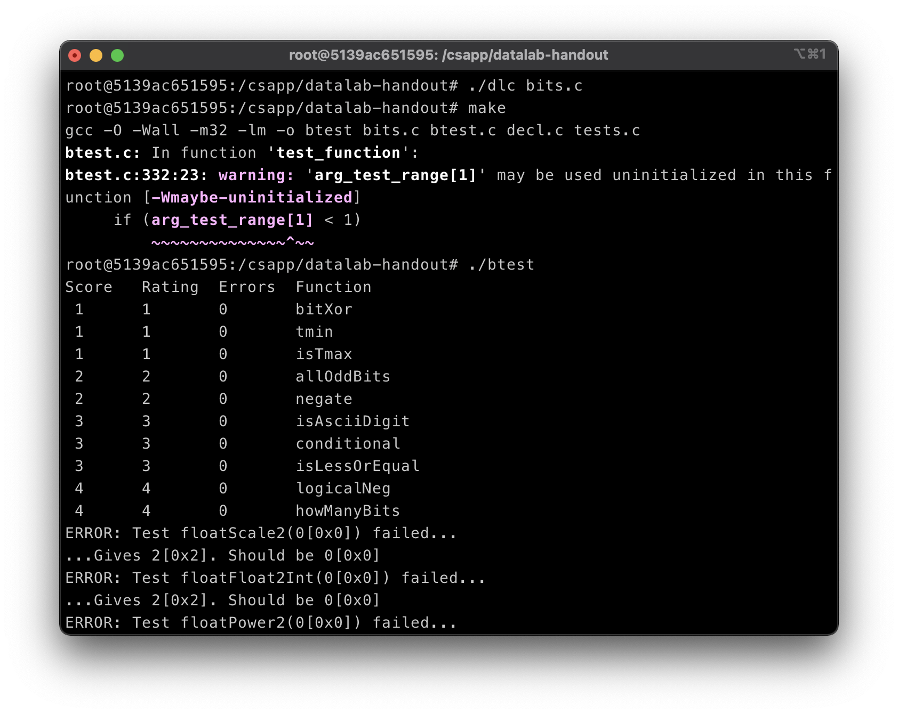

# Data Lab

## 介绍

学生实现简单的逻辑，二进制补码和浮点函数，但使用C语言运算符受限。例如，可能会要求他们仅使用位级运算和直线代码来计算数字的绝对值。本实验可帮助学生理解C数据类型的位表示形式以及对数据进行操作的位级别行为。

[实验地址](http://csapp.cs.cmu.edu/3e/labs.html)

[README文档](http://csapp.cs.cmu.edu/3e/README-datalab)

[实验指导](http://csapp.cs.cmu.edu/3e/datalab.pdf)

## 实验步骤

1. 阅读`bits.c`文件的注释，在函数处填入合适的代码。
2. 命令行使用`./dlc bits.c`命令，检查实验编码规范是否符合。
3. 使用`make`命令进行编译文件。
4. 使用`./btest`程序检查函数的正确性。
5. 使用`./driver.pl`获取函数正确性以及评分。

下图为实验步骤的展示。


### 实验内容

#### bitXor
```c
/* 
 * bitXor - x^y using only ~ and & 
 *   Example: bitXor(4, 5) = 1
 *   Legal ops: ~ &
 *   Max ops: 14
 *   Rating: 1
 */
int bitXor(int x, int y) {
  return ~(~(x & ~y) & ~(~x & y));
}
```

> 仅使用`~`和`&`运算符实现异或。

分析：

我们需要求：相同为1，不同为0。我们位操作数是a, b。

当`a = 1, b = 0` -> `a & ~b = 1 = a ^ b`。

当`a = 0，b = 0` -> `a & ~b = 0 = a ^ b`。

当`a = 1, b = 1` -> `a & ~b = 0 = a ^ b`。

当`a = 0, b = 1` -> `a & ~b = 0 != a ^ b`。

我们使用`a & ~b`，发现在位操作数是1和0的情况下，只需要把为0的操作数取反即可以得到异或的效果。而我们并不知道取反的位操作数是第一个操作数还是第二个，我们可以使用`(a & ~b) | (~a & b)`来达到效果。我们可以使用`&`和`~`来达到`|`的效果。
我们利用`a | b = ~(~a & ~b)`。所以我们得到`x ^ y = ~((~(x & ~y) & ~(~x & y)))`。

#### tmin

```c
/* 
 * tmin - return minimum two's complement integer 
 *   Legal ops: ! ~ & ^ | + << >>
 *   Max ops: 4
 *   Rating: 1
 */
int tmin(void) {
  return (0x1 << 31);
}
```

> 返回最小的二进制补码。

分析：

实验假定int为32位表示，tMin便是0x80000000。利用左移动运算符可以轻松得到tMin。

#### isTmax

```c
/*
 * isTmax - returns 1 if x is the maximum, two's complement number,
 *     and 0 otherwise 
 *   Legal ops: ! ~ & ^ | +
 *   Max ops: 10
 *   Rating: 1
 */
int isTmax(int x) {
  int isNegate = !(~x);
  return !((~(x + 1) ^ x) | isNegate);
}
```

> 如果x是最大的二进制补码数返回1，否则返回0。

分析：

tMax的二进制表示是0x7fffffff，观察特征后，tMax加1后取反仍是tMax。我们可以通过`~(x + 1) ^ x`是否等于0来判断一个数是否是tMax，我们发现还有一个数符合这种条件，0xffffffff也就是-1也满足该条件。我们只需判断是-1的情况下便可以用该条件判断是否是tMax。

