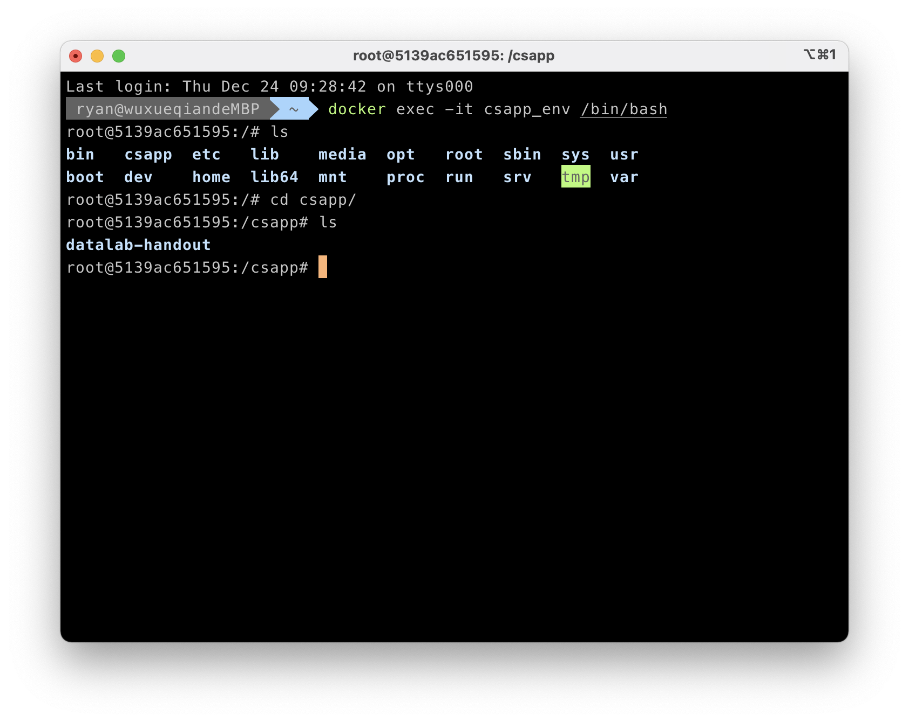

# 目录

- [项目背景](#项目背景)
- [下载](#下载)
- [实验列表](#实验列表)
- [实验环境搭建](#实验环境搭建)
- [实验进度](#实验进度)
- [开源协议](#开源协议)

# 项目背景

记录《深入理解计算机系统》的实验记录和学习思考。

# 下载

在命令行中运行以下命令。
```
unix> git clone https://github.com/ChinaWxq/CSAPP-Lab.git
```

# 实验列表

- [Data Lab](https://github.com/ChinaWxq/CSAPP-Lab/tree/master/Data%20Lab)
- [Bomb Lab](https://github.com/ChinaWxq/CSAPP-Lab/tree/master/Bomb%20Lab)
- [Attack Lab]()
- [Buffer Lab]()
- [Architecture Lab]()
- [Cache Lab]()
- [Performance Lab]()
- [Shell Lab]()
- [Malloc Lab]()
- [Proxy Lab]()

# 实验环境搭建

## 下载


实验环境是unix环境，推荐使用Linux环境，macOS与Linux环境还是有区别，所以推荐使用Docker的Linux容器搭建轻量级Linux环境。

### Docker下载

[菜鸟编程教你安装Docker](https://www.runoob.com/docker/macos-docker-install.html)

### 配置Ubuntu

1. 从仓库拉去Ubuntu镜像
```
docker pull ubuntu:18.04
```

2. 从Ubuntu镜像中创建容器，命名为`csapp_env`，且将本地文件夹`/Users/ryan/Desktop/Lab`挂载到`/csapp`文件夹目录下，我们的实验文件夹也是下载在这里。资源通过该文件夹和容器共享。
```
docker container run -it -v /Users/ryan/Desktop/Lab:/
csapp --name=csapp_env ubuntu:18.04 /bin/bash
```



3. 更新apt软件源
```
apt-get update
```

4. 安装sudo
```
apt-get install sudo
```

5. 安装c/c++编译环境
```
sudo apt-get install build-essential
```

6. 补充gcc的完整环境
```
sudo apt-get install gcc-multilib
```

7. 安装gdb
```
sudo apt-get install gdb
```

# 实验进度

- [x] [Data Lab]
- [x] [Bomb Lab]
- [ ] [Attack Lab]
- [ ] [Buffer Lab]
- [ ] [Architecture Lab]
- [ ] [Cache Lab]
- [ ] [Performance Lab]
- [ ] [Shell Lab]
- [ ] [Malloc Lab]
- [ ] [Proxy Lab]

# 开源协议

MIT License Copyright (c) 2020 Ryan
